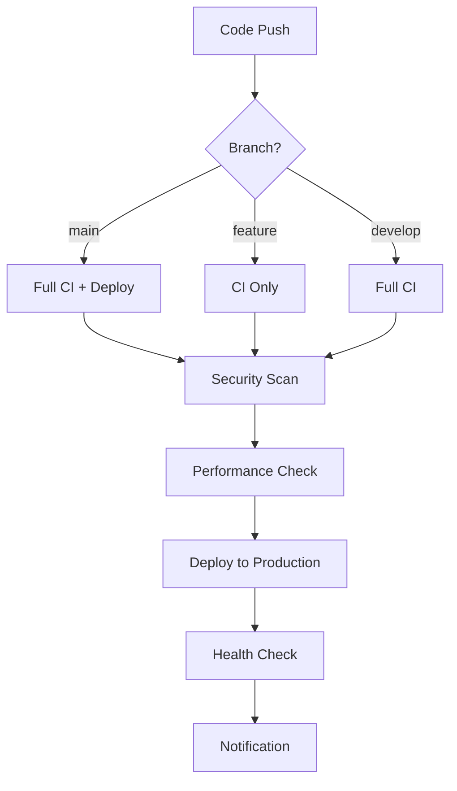

# GitHub Actions CI/CD Documentation

This repository uses GitHub Actions for continuous integration, deployment, and security monitoring. This document explains the workflow setup and how to configure the required secrets and variables.

## 🔄 Workflows Overview

### 1. CI Workflow (`ci.yml`)
**Triggers:** Push to `main`/`develop`, Pull Requests
**Purpose:** Build, test, lint, and type-check the codebase

**Jobs:**
- **Changes Detection**: Optimizes workflow by detecting which parts of the codebase changed
- **Setup**: Installs dependencies with proper caching
- **Lint**: Runs Biome linting across all packages
- **Test**: Runs Vitest tests in parallel for webapp, auth, and storage packages
- **Build**: Builds all packages using Turbo
- **Type Check**: Validates TypeScript types across all packages

### 2. Deploy Workflow (`deploy.yml`)
**Triggers:** Push to `main`, Manual dispatch
**Purpose:** Deploy to Cloudflare Workers

**Features:**
- Environment-specific deployments (staging/production)
- Health checks post-deployment
- Deployment summaries
- Multiple worker deployment (main app + LiveStore sync)

### 3. Security Workflow (`security.yml`)
**Triggers:** Push/PR to `main`/`develop`, Weekly schedule, Manual dispatch
**Purpose:** Comprehensive security scanning

**Scans:**
- **Dependency Vulnerabilities**: Uses `pnpm audit`
- **Secret Scanning**: TruffleHog for leaked secrets
- **Code Analysis**: GitHub CodeQL for security issues
- **Container Security**: Trivy scanning (scheduled runs)

### 4. Package Audit Workflow (`package-audit.yml`)
**Triggers:** Daily schedule, Manual dispatch
**Purpose:** Detailed vulnerability analysis with auto-fix capabilities

**Features:**
- Workspace-specific auditing
- Configurable severity thresholds
- Auto-fix with PR creation
- Critical vulnerability notifications

### 5. Performance Workflow (`performance.yml`)
**Triggers:** Push to `main`, Pull Requests
**Purpose:** Monitor performance and bundle size

**Features:**
- Bundle size analysis and comparison
- Lighthouse performance audits
- PR comments with performance metrics

## 🔧 Required Configuration

### GitHub Secrets

Set these in Repository Settings → Secrets and variables → Actions:

```bash
# Cloudflare Configuration
CLOUDFLARE_API_TOKEN=your_cloudflare_api_token
CLOUDFLARE_ACCOUNT_ID=your_cloudflare_account_id

# Application Secrets
LIGHTHOUSE_API_KEY=your_lighthouse_api_key
GEIST_JWT_SECRET=your_jwt_secret
```

### GitHub Variables

Set these in Repository Settings → Secrets and variables → Actions → Variables:

```bash
# Application Configuration
VITE_LIVESTORE_SYNC_URL=https://your-sync-url.com
VITE_LIVESTORE_STORE_ID=your-store-id
VITE_HOST=https://your-host.com
```

### Environment Setup

#### Production Environment
- **Name**: `production`
- **URL**: `https://filecoin.geist.network`
- **Protection Rules**: Require reviews, restrict to main branch

#### Staging Environment  
- **Name**: `staging`
- **URL**: `https://staging.filecoin.geist.network`
- **Protection Rules**: Less restrictive for testing

## 📦 Dependency Management

### Dependabot Configuration
- **Schedule**: Weekly updates on different days for each package
- **Grouping**: Related dependencies are grouped together
- **Auto-review**: Configured for team review assignment

### Update Strategy
- **Dev Dependencies**: Minor/patch updates grouped together
- **UI Dependencies**: Radix UI components grouped
- **React Ecosystem**: React-related packages grouped
- **LiveStore/Storage**: Domain-specific groupings

## 🚀 Deployment Process

### Automatic Deployment
1. Code pushed to `main` branch
2. CI workflow validates code quality
3. Deploy workflow triggers automatically
4. Health checks verify deployment

### Manual Deployment
1. Go to Actions → Deploy to Cloudflare Workers
2. Click "Run workflow"
3. Select environment (staging/production)
4. Monitor deployment progress

### Deployment Verification
- Automated health checks test endpoint availability
- Deployment summaries provide status updates
- Failed deployments trigger notifications

## 🔒 Security Practices

### Automated Security Scanning
- **Daily**: Package vulnerability audits
- **Weekly**: Comprehensive security scans
- **On PR**: Dependency and secret scanning
- **Monthly**: Container security scans

### Vulnerability Response
1. **Critical/High**: Immediate alerts and auto-fix attempts
2. **Medium**: Weekly reports and manual review
3. **Low**: Grouped with regular dependency updates

### Secret Management
- All sensitive data stored in GitHub Secrets
- Environment-specific variable separation
- Regular secret rotation reminders

## 🎯 Performance Monitoring

### Bundle Analysis
- **On PR**: Bundle size comparison with base branch
- **Metrics**: Total size, chunk analysis, dependency impact
- **Alerts**: Significant size increases flagged

### Lighthouse Audits
- **Metrics**: Performance, Accessibility, Best Practices, SEO
- **Thresholds**: Configurable performance budgets
- **Reports**: Detailed analysis with recommendations

## 📊 Workflow Optimization

### Caching Strategy
- **pnpm Store**: Global package cache
- **Node Modules**: Workspace-specific caching
- **Build Artifacts**: Cross-job artifact sharing

### Parallel Execution
- **Tests**: Run per workspace in parallel
- **Type Checking**: Parallel package validation
- **Security Scans**: Independent concurrent scans

### Resource Efficiency
- **Change Detection**: Skip unnecessary jobs
- **Conditional Execution**: Environment-based job triggering
- **Artifact Lifecycle**: Appropriate retention periods

## 🛠️ Troubleshooting

### Common Issues

#### Build Failures
```bash
# Check Node.js version compatibility
node --version  # Should be 23+

# Verify pnpm version
pnpm --version  # Should be 10.13.1+

# Clear caches
pnpm store prune
```

#### Deployment Issues
```bash
# Verify Cloudflare credentials
wrangler whoami

# Check environment variables
wrangler secret list

# Manual deployment test
pnpm --filter @geist-filecoin/webapp run deploy
```

#### Security Scan Failures
```bash
# Local audit
pnpm audit --audit-level moderate

# Fix vulnerabilities
pnpm audit --fix

# Check for secrets
git log --all --grep="password\|secret\|key" --oneline
```

### Getting Help

1. **Workflow Failures**: Check the Actions tab for detailed logs
2. **Deployment Issues**: Review Cloudflare dashboard and logs
3. **Security Alerts**: Check the Security tab for vulnerability details
4. **Performance Issues**: Review Lighthouse reports and bundle analysis

## 📈 Metrics and Monitoring

### Key Metrics Tracked
- **Build Times**: Average and trend analysis
- **Test Coverage**: Per package coverage reports  
- **Bundle Sizes**: Size trends and impact analysis
- **Security Vulnerabilities**: Count and severity tracking
- **Deployment Success Rate**: Reliability metrics

### Reporting
- **Weekly**: Automated dependency update summaries
- **Monthly**: Security posture reports
- **On Demand**: Performance analysis reports
- **Real-time**: Deployment status and health checks

---

## 🔄 Workflow Lifecycle



This comprehensive CI/CD setup ensures code quality, security, and reliable deployments while maintaining developer productivity through intelligent caching and parallel execution.