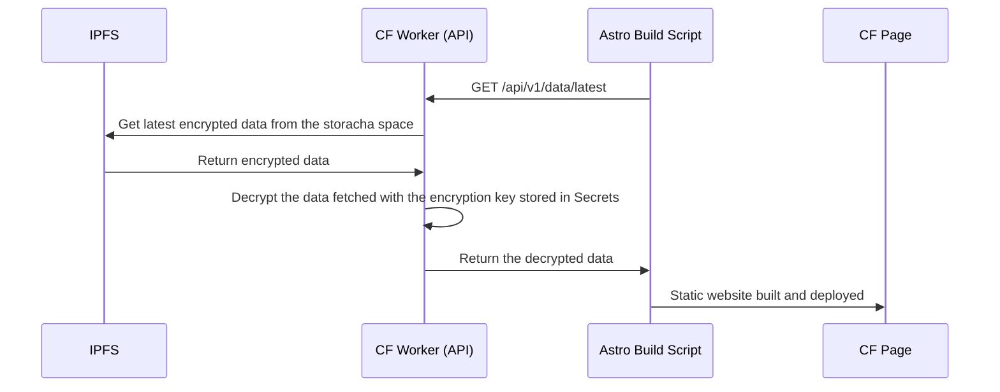

# Geist - V0

## Milestones

| Number | Grant Deliverable                     | Briefly describe how you will meet deliverable objectives                                                                 | Timeframe (within 3 months) |
| :----- | :------------------------------------ | :------------------------------------------------------------------------------------------------------------------------ | :-------------------------- |
| 1.     | No-code editor                        | Develop No-code editor to create structured data and upload to filecoin                                                   | Wk1-Wk4                     |
| 2.     | Access control with on-chain criteria | Develope Dashboard and data api to allow team to configure and collaborate with different roles base on on-chain criteria | Wk5-Wk8                     |
| 3.     | Deployment and Publishing             | Develop Scripts and showcase to deploy and publishto various targets                                                      | Wk8-Wk12                    |

## Deployment and Publishing

Develop Scripts and showcase to deploy and publish to various targets.

### Deliverables

#### Edge Delivery Content APIs

A TypeScript serverless function hosted on Cloudflare Workers serves as the API endpoint for retrieving decrypted content (JSON, images, videos).

Authentication: Include access token via `Authorization` header or `access_token` query parameter.

Access tokens are generated in the APIs tab of each space in the Geist web app.

#### Astro Static Blog Demo

A demo blog site built with astro using inline loader to load contents delivered by edge delivery content APIs.

### Sequence Diagram



update `resources.ts` to export a function called `fetchResrouce`, which i use to fetch a resource from the current storacha space. the resourceId would be of string type. 
The fetchResource function will do the following:
1. get all the files from the storacha space
2. the filenames we are looking for is:
{resourceId}_map.json. It will be an array of cids which allows us to get all the entries of a resource.

### File structure

```bash
Storacha Space (:did)
- dir cid
    - {resourceId}.encrypted.json
    - {resourceId}_map.encrypted.json
- dir cid
    - {resourceId}.encrypted.json
    - {resourceId}_map.encrypted.json
```

For example,
```bash
Storacha Space (did:key:z6MkksCTrQAGDkFZp34CLcnzoqbddAVExKj5GHmHSCuRNuaX)
- dir cid (cid: bafy0)
    - landing.encrypted.json (cid: bafy1)
    - landing_map.encrypted.json (cid: bafy2)
- dir cid (cid: bafy3)
    - blog.encrypted.json (cid: bafy4)
    - blog_map.encrypted.json (cid: bafy5)
- dir cid (cid: bafy6)
    - blog.encrypted.json (cid: bafy7)
    - blog_map.encrypted.json (cid: bafy8)
- dir cid (cid: bafy9)
    - landing.encrypted.json (cid:bafy10)
    - landing_map.encrypted.json (cid:bafy11)
```

In the example, `landing` and `blog` are `resourceId`. We will need to fetch the 
