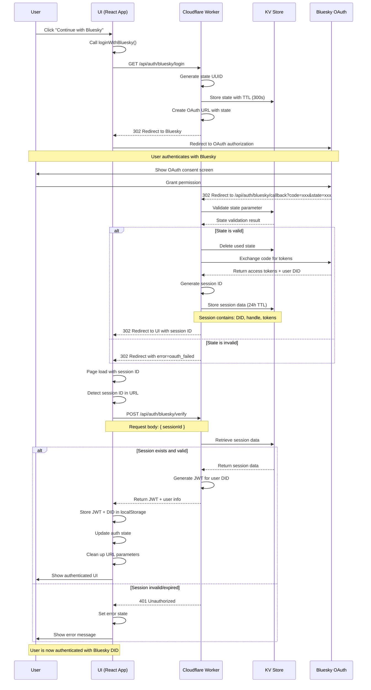

# E2E Tests for Bluesky OAuth Integration

This directory contains end-to-end tests for the Bluesky OAuth integration using Playwright.

## OAuth Flow Sequence Diagram



## OAuth Flow Components

### **1. OAuth Initiation** (`/api/auth/bluesky/login`)
- Generates unique state parameter for CSRF protection
- Stores state in KV store with 5-minute TTL
- Creates Bluesky OAuth authorization URL
- Redirects user to Bluesky for authentication

### **2. OAuth Callback** (`/api/auth/bluesky/callback`)
- Validates state parameter against stored value
- Exchanges authorization code for access tokens
- Extracts user DID and handle from Bluesky response
- Generates session ID and stores user data
- Redirects to frontend with session ID

### **3. Session Verification** (`/api/auth/bluesky/verify`)
- Validates session ID from frontend
- Retrieves stored user data from KV
- Generates JWT token for authenticated user
- Returns user info (DID, handle) to frontend

### **4. UI Integration**
- Detects OAuth callback parameters in URL
- Automatically verifies session on page load
- Stores authentication data in localStorage
- Updates UI to show authenticated state
- Cleans up URL parameters

## Security Features

- **CSRF Protection**: State parameter prevents cross-site request forgery
- **Session Expiration**: OAuth states (5min) and sessions (24h) have TTL
- **Secure Storage**: Sensitive data stored in Cloudflare KV with encryption
- **JWT Integration**: Seamless integration with existing auth system
- **Error Handling**: Proper error responses and redirects

## Test Files

- `bluesky-oauth.spec.ts` - Basic OAuth flow tests
- `bluesky-oauth-comprehensive.spec.ts` - Comprehensive OAuth tests with different scenarios
- `bluesky-oauth-api.spec.ts` - API endpoint tests
- `example.spec.ts` - Basic example tests
- `helpers/auth-helpers.ts` - Helper functions for authentication testing

## Running Tests

### Prerequisites

1. Install dependencies:
```bash
npm install
```

2. Install Playwright browsers:
```bash
npx playwright install
```

3. Start the development servers:
```bash
# Terminal 1: Start the web application
npm run dev

# Terminal 2: Start the Cloudflare Worker
cd ../cf-worker
npm run dev
```

### Running Tests

```bash
# Run all e2e tests
npm run test:e2e

# Run tests in UI mode
npm run test:e2e:ui

# Run tests in debug mode
npm run test:e2e:debug

# Run a specific test file
npx playwright test bluesky-oauth.spec.ts

# Run tests in a specific browser
npx playwright test --project=chromium
```

## Test Structure

### Basic OAuth Flow Tests (`bluesky-oauth.spec.ts`)
- UI element visibility
- Login dialog functionality
- OAuth redirect flow
- Callback handling
- Error states

### Comprehensive Tests (`bluesky-oauth-comprehensive.spec.ts`)
- Detailed UI testing
- Loading states
- Error handling
- Mobile responsiveness
- Accessibility testing
- Integration with existing auth

### API Tests (`bluesky-oauth-api.spec.ts`)
- OAuth endpoint testing
- CORS configuration
- Error handling
- Rate limiting
- Security validation

## Test Environment

The tests use the following configuration:
- **Frontend**: http://localhost:5173
- **API**: http://localhost:8787
- **Browsers**: Chrome, Firefox, Safari, Mobile Chrome, Mobile Safari

## Mocking

The tests extensively use mocking for:
- OAuth API responses
- Network requests
- Authentication states
- Error conditions

This ensures tests run reliably without requiring actual Bluesky OAuth integration during testing.

## Helper Functions

The `AuthHelpers` class provides reusable functions for:
- Opening login dialogs
- Switching between auth tabs
- Mocking OAuth responses
- Checking authentication states
- Cleaning up test data

## Environment Variables

Tests use the following environment variables:
- `VITE_API_URL` - API base URL (defaults to http://localhost:8787)
- `VITE_LIVESTORE_SYNC_URL` - LiveStore sync URL

## CI/CD Integration

The tests are configured for CI/CD with:
- Automatic retry on failure
- HTML reporting
- Screenshot capture on failure
- Video recording for failed tests
- Trace collection for debugging

## Debugging

For debugging failed tests:

1. **View HTML Report**:
```bash
npx playwright show-report
```

2. **Run in Debug Mode**:
```bash
npm run test:e2e:debug
```

3. **View Traces**:
```bash
npx playwright show-trace trace.zip
```

## Best Practices

1. **Test Isolation**: Each test clears authentication data before running
2. **Mocking**: External services are mocked to ensure reliability
3. **Error Handling**: Tests cover both success and failure scenarios
4. **Accessibility**: Tests include keyboard navigation and ARIA checks
5. **Mobile**: Tests include mobile viewport testing

## Common Issues

1. **Port Conflicts**: Ensure ports 5173 and 8787 are available
2. **Server Startup**: Wait for both servers to be fully started
3. **Browser Installation**: Run `npx playwright install` if browsers are missing
4. **Test Timeout**: Increase timeout for slow environments

## Adding New Tests

When adding new OAuth-related tests:

1. Use the `AuthHelpers` class for common operations
2. Mock external API calls
3. Test both success and failure scenarios
4. Include accessibility checks
5. Clean up test data in `beforeEach`